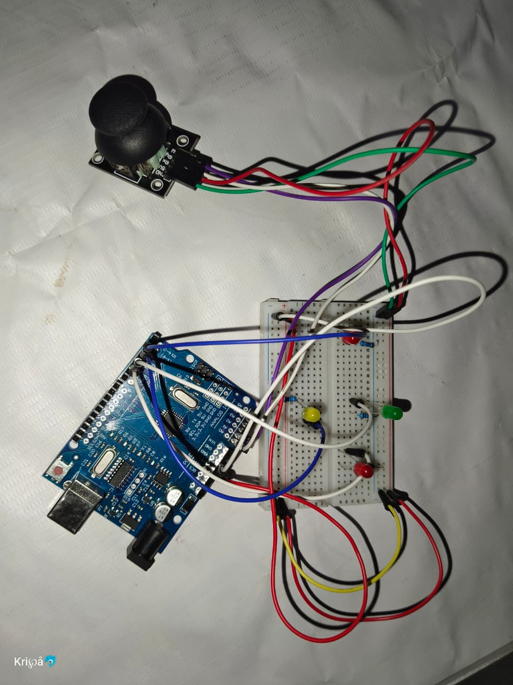

# 🎮 Joystick LED Control using Arduino

This project controls 4 LEDs using a joystick module and Arduino UNO.

## 🚀 Features
- ⬅️ Left movement → Left LED ON
- ➡️ Right movement → Right LED ON
- ⬆️ Up movement → Up LED ON
- ⬇️ Down movement → Down LED ON

---

## 🛠 Components Used
- Arduino UNO
- Joystick Module
- 4 LEDs
- Resistors
- Breadboard
- Jumper Wires

---

## 📸 Project Image


---
## 🎥 Demo Video

[](https://www.youtube.com/shorts/eAskB3tHsts)

---

## 💻 Arduino Code
```cpp
// Your Arduino code here
int xPin = A0;
int yPin = A1;

int rightLED = 2;
int leftLED  = 3;
int upLED    = 4;
int downLED  = 5;

void setup() {

  pinMode(rightLED, OUTPUT);
  pinMode(leftLED, OUTPUT);
  pinMode(upLED, OUTPUT);
  pinMode(downLED, OUTPUT);

  Serial.begin(9600);
}

void loop() {

  int xValue = analogRead(xPin);
  int yValue = analogRead(yPin);

  // Sab LEDs OFF
  digitalWrite(rightLED, LOW);
  digitalWrite(leftLED, LOW);
  digitalWrite(upLED, LOW);
  digitalWrite(downLED, LOW);

  // RIGHT
  if (xValue > 700) {
    digitalWrite(rightLED, HIGH);
  }

  // LEFT
  else if (xValue < 300) {
    digitalWrite(leftLED, HIGH);
  }

  // UP
  else if (yValue > 700) {
    digitalWrite(upLED, HIGH);
  }

  // DOWN
  else if (yValue < 300) {
    digitalWrite(downLED, HIGH);
  }

  // CENTER = sab OFF

  delay(50);
}
